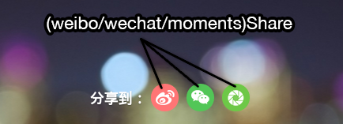

Murph - Single Campaign Generator
===================

Murph is a web page generator & editor for marketing campaigns.
Github repo of the project : https://github.com/wandoulabs/Murph

----------

Template
-------------

#### Create a new campaign
Create a new file from *app/pages* directory and insert these lines :

```
var React = require('react');
var _ = require('lodash');
var WDJ = require ('components');
var StyleSheet = require('stilr');

var App = React.createClass({
    componentDidMount: function() {
        var stylesheet = document.createElement('style');
        stylesheet.textContent = StyleSheet.render();
        document.head.appendChild(stylesheet);
    },
    
    render: function () {
        return (
            // Insert your project here
        );
    }
});

React.render(<App/>,document.body);
```
You can also find usage examples in *app/pages/examples*.

Generation
-------------

Open the project directory with your terminal and lunch this command line :
```
 npm install
```

#### Development

```
grunt server
```
    
This command will generate all templates, create a local server (*localhost:9997*) and watch your live modifications from all **templates** and **components**.


#### Production

```
grunt build
```
    
This command will generate all templates created into */dist* directory.

Components
---------------

####Page
Create a new campaign page.

**Example**
```
<Page>
    <WDJ.Image
        image="http://www.wandoujia.com/logo.png"
    />
</Page>
```

####Image

**Properties**

- image: source url

**Existing classnames**

- image

**Example**
``` 
<WDJ.Image
    image="http://www.wandoujia.com/logo.png"
/>
``` 

####Page
Create a new slide.

**Example**

```
<Page>
    <WDJ.Image
        image="http://www.wandoujia.com/logo.png"
    />
</Page>
```

####Pages

Create a new horizontal/vertical group of pages.

**Properties**

- direction
- parallax
- customStyle

**Example**
```
<WDJ.Page>
    <Page>...</Page>
    <Page>...</Page>
</WDJ.Page>
```
    
####Pages
----------
Create a new horizontal/vertical group of pages (contain multiple pages).

**Existing classnames**

- background

**Properties**

- direction: define slides direction (values: "horizontal" or "vertical")
- parallax: speed in percentage for parallax image background
- customStyle

**Example**
```
<WDJ.Pages direction="h">
    <Page>Slide 1</Page>
    <Page>Slide 2</Page>
</WDJ.Pages>
```

####App Card
----------
Display an app card with default or custom datas.


**Existing classnames**

- card
- viewDetail
- icon
- metaWrap
- meta
- description
- iconButton
- installButton

**Properties**

- packageName
- icon: defining a custom app icon
- title: defining a custom app title
- description: defining a custom description
- customStyle

**Example**
```
<WDJ.AppCard
    packageName="com.tencent.mm" 
    title="Custom Title"
/>
```

####Card List
----------


**Existing classnames**

- cardListWrap
- cardList

**Properties**

- dataValue
- customStyle

**Example**
  
```
<WDJ.CardList
    dataValue={
        [
        <AppCard
            packageName="com.xiudang.jiukuaiyou.ui"
         />,
         <AppCard 
            packageName="com.youku.phone"/>
        ]
    }
/>
```

####Download Button
----------


**Properties**

- packageName
- customStyle

**Example**
```
<WDJ.DownloadButton
    packageName="com.youku.phone">
    Button
</WDJ.DownloadButton>
```

####Share Buttons (ShareWechat, ShareMoments & ShareWeibo)
----------



**Properties**

- content
- size
- customStyle

**Example**

```
<WDJ.ShareWechat
    url="http://example.com"
    title="Moments Share"
    desc="Moments description example">
    
</WDJ.ShareWechat>
```

####QR Code
----------

**Properties**

- content
- size
- customStyle

**Example**
```
<WDJ.QRCode
    size="9" 
    content="http://www.wandoujia.com"
/>
```

Custom Style
-------------
For each components, you can add or modify existing class names or modifying existing ones. To do it, use the property *customStyle*.

**Example**

This is a simple example with existing classnames from App Card component.

```
<WDJ.AppCard customStyle={{
        installButton: {
            background: '#fff'
        },
        card: {
            backgroundColor: '#333',
            color: '#fff'
        },
        description : {
            color: '#fff',
            borderTop: '1px dashed #999'
        },
        metaWrap: {
            color: '#fff'
        }
    }}
    packageName="vstudio.android.camera360"/>
```

TODO
---------------

+ UI Builder
+ Text component
+ Advanced Video Component